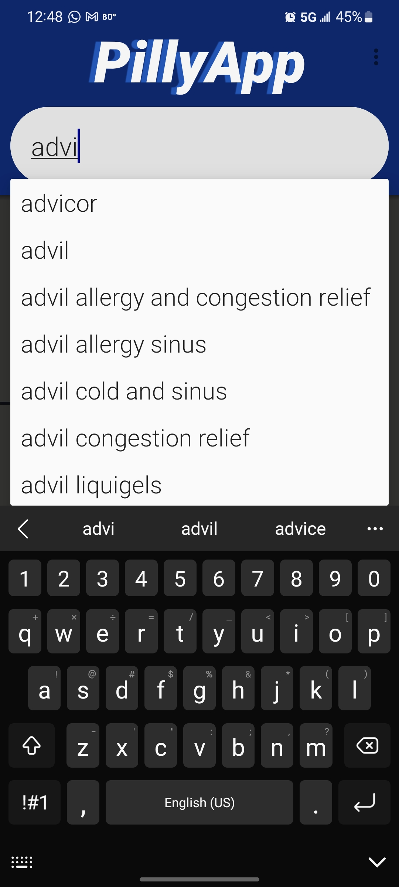
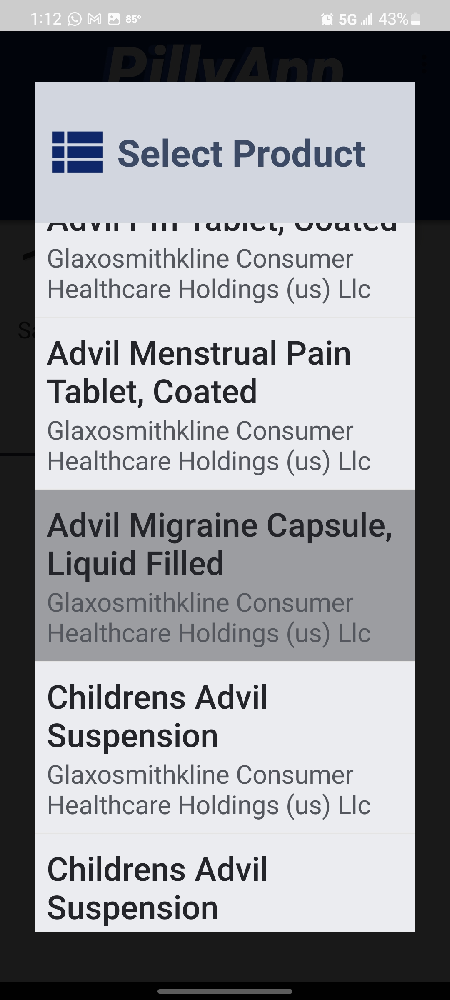
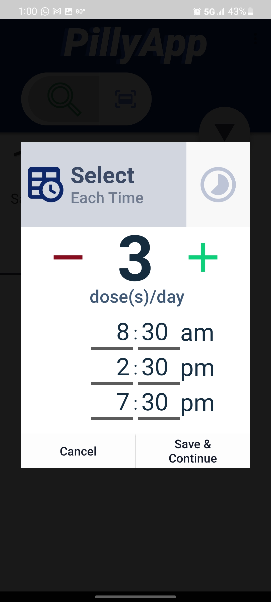
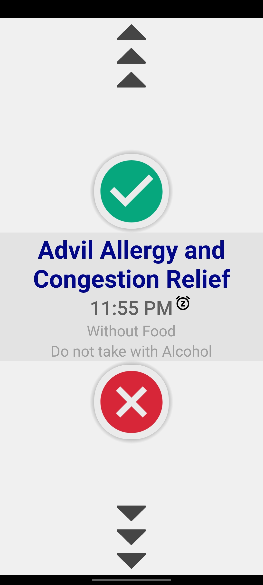
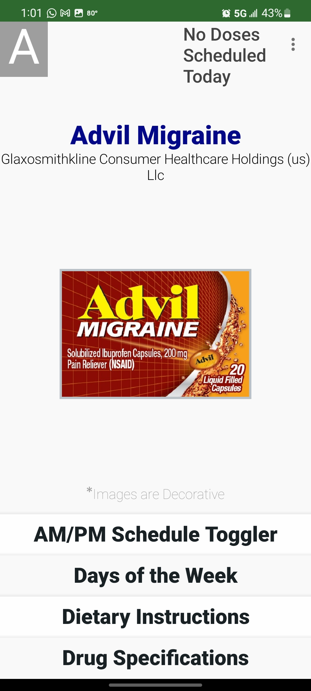
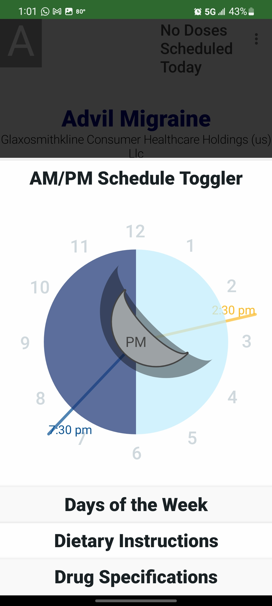
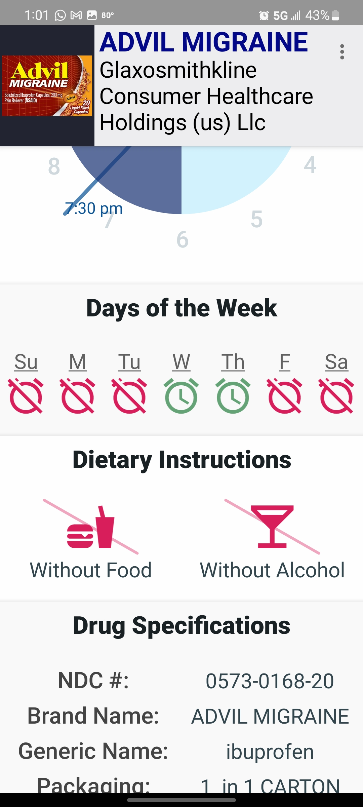

 
   

 <i>Google Play and the Google Play logo are trademarks of Google LLC.</i>

 
 
  
<h1>Welcome to Pilly, your Personal Medication Reminder App</h1>
<h2>Overview</h2>

In today's bustling world, staying on top of medication schedules is a common struggle, especially for those managing multiple prescriptions. Pilly is here to transform this chore into a seamless habit. Developed with passion and precision, Pilly serves as a reliable companion, ensuring you never miss a dose again. This mobile application embodies a blend of vibrant animations and dynamic layouts to offer an engaging user experience.

<h2>Languages</h2>
<ul>
    <li><b>Java</li>
    <li><b>XML</li>    
</ul>

<h2>About the App</h2>

Pilly simplifies medication management through an interactive and user-friendly interface. As the project's sole developer, I dove deep into the realms of Java and explored a variety of APIs and libraries within the Android ecosystem to bring this application to life. My vision was clear: to make medication adherence as straightforward and pleasing as possible.

Key Features:

<ul>
    <li><b>Easy Medication Search:</b> Begin by entering a medication name, and Pilly instantly provides a list of suggestions based on your input.  </li>
     
    
 </img>

     
    <li><b>Simplified Data Entry:</b> Select a medication and smoothly navigate through a series of dialogs to input essential details. Our aim is to make the process focused and hassle-free.</li>
     
    
 
       </img>&nbsp&nbsp&nbsp&nbsp&nbsp&nbsp&nbsp 
      </img>
    

     
    <li><b>Custom Reminders:</b> Finalize your schedule, and Pilly will remind you with timely notifications, ensuring you stay on track with your medication.</li>
     
    
 </img>

     
    <li><b>Vibrant Animations & Layouts:</b> Experience the joy of an app that's not just functional but also delightful to interact with.</li>
        
      
     
      </img>&nbsp&nbsp&nbsp&nbsp&nbsp&nbsp&nbsp
      </img>&nbsp&nbsp&nbsp&nbsp&nbsp&nbsp&nbsp
      </img>     
    

      
    <li><b>Innovative Medication Reader Prototype:</b> Streamline data entry with a tool that extracts information directly from medication labels. (Note: This feature is in the development phase and welcomes early users for feedback.)👇</li>
</ul>

<h2>Prototype and Progress</h2>

Pilly is continually evolving, with our current focus on a prototype reader designed to minimize manual data entry. By capturing an image of your medication label, the app pre-fills information, only requiring you to set reminder times and days. Although this feature is still under refinement, it represents a significant leap towards our goal of effortless medication management.

For more information, explore our <a href="https://abhat.io/app/software/cloud/cloud.html">Medication Label Reader</a> feature
  To dive deeper into the development and updates, visit our <a href="https://github.com/abGit9/Med_Label_Reader">GitHub Repository.</a>

<h2>About This Repository and Introductory Video</h2>

This Github repo is dedicated to the app's  initial onboarding tutorial. It consists of a series of animations that introduces the user to the app's core functionality and offers a glimpse into the UI's accessible design and its lively, animated presentation.

 A video demonstration is available below, showcasing Pilly in action. Watch the intro running on a mobile device to get a feel for the application's flow and user engagement.

https://user-images.githubusercontent.com/50727486/167315126-dbe32c6f-a588-4772-808c-89d17e728c98.mp4

<h2>Dive Deeper</h2>

For a nuanced dive into the technical underpinnings of Pilly's standout features, crafted through Java programming, take a look at my <a href="https://abhat.io/app/software/mobile/mobile.html">website</a>. Here, you'll discover the meticulous detail and programming strategies employed in the app's development, including these features:

<ul>
    <li><b>The Dynamic Clock (AM/PM Schedule Toggler)</b></li>
    <li><b>Medication Reminders</b></li>
    <li><b>Real-Time Medication Name Database</b></li>
    <li><b>Custom UI Components</b></li>
    <li><b>Data Persistence via SQLiteOpenHelper</b></li>
</ul>

Explore more on <a href="https://abhat.io/app/software/mobile/mobile.html">The Pilly Page</a>.

<h2>Acknowledgements</h2>

Thank you for your interest in Pilly. Together, let's make medication adherence a less daunting task. Stay tuned for more updates and features as we progress on this exciting journey.

Thanks.

